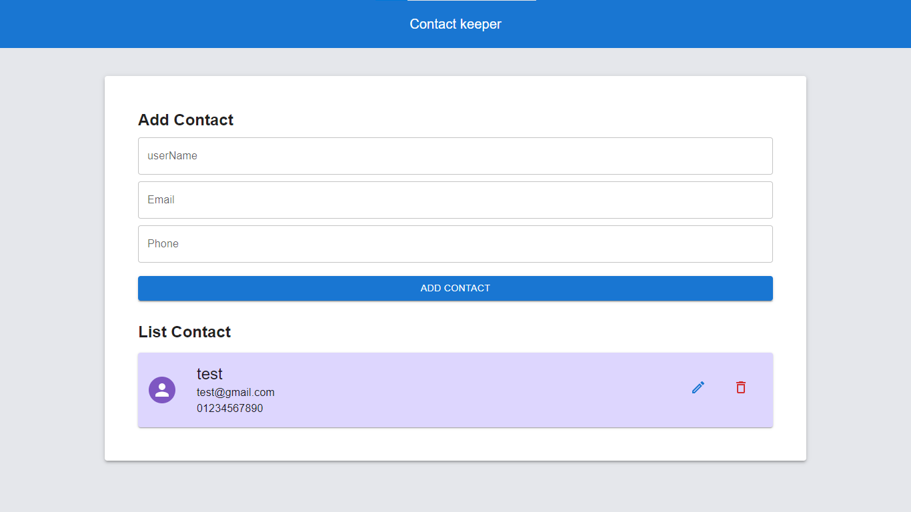

# contact Keeper

contact Keeper is react app lets you save your contact in jsonserver

# ScreenShot


# Technologies used

* React 
* MaterialUI
* Json Server

# Installing dependencies
This repo uses Yarn and npm to install dependencies run this command :

```
npm install 
yarn 
```
# Usage


To run project :
```
npm start / yarn start
```
To run server choose another commend line and do this  :
```
npm start / yarn start
```
